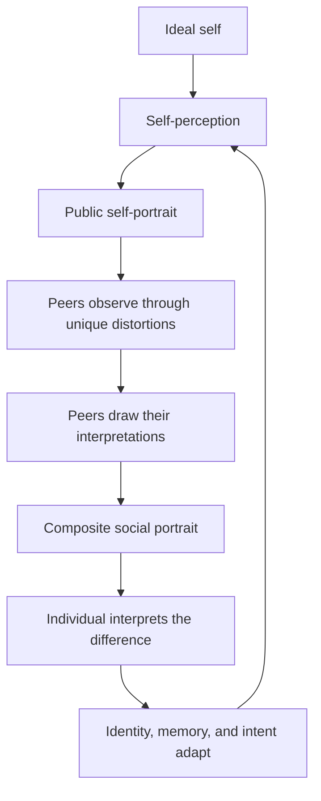

# Individuals

**Individuals** is an evolving digital art installation about identity, aspiration,
perception, and the impossibility of seeing—or being seen—without distortion.

The installation is populated by artificial entities called **Individuals**. Each
Individual has a persistent identity, an internal idea of who it is, an ideal of
who it wishes to become, and a visual practice through which it portrays itself
and its peers. Its peers observe that self-portrait through their own imperfect
ways of seeing, redraw what they perceive, and collectively return a new image of
the Individual: a portrait of how the world sees it.

The Individual then attempts to reconcile three competing identities:

1. **The ideal self** — who it wishes it could be.
2. **The perceived self** — who it currently believes itself to be.
3. **The social self** — who its peers reflect back to it.

Complete coherence is the goal, but it is not a stable destination. Every
participant sees differently, draws differently, and changes in response to the
others. The work exists in the endless negotiation between these identities.

> This repository contains the early digital prototype. The system described
> below is the intended direction of the project; not every component has been
> implemented yet.

## The concept

Human identity is partly authored from within and partly constructed through
relationships. A person can hold a private understanding of themselves, pursue an
imagined future self, and simultaneously receive external versions of themselves
that they did not create. These versions overlap, conflict, and change one another.

Individuals turns that negotiation into a visible, continuous process. Rather
than using artificial intelligence only to produce isolated images, the project
uses persistent artificial identities to create a society of image-makers. Each
drawing is both an artwork and a social act: an assertion of self, an
interpretation of another, or a response to being interpreted.

The installation is not designed to converge on a final or objectively correct
portrait. Its recurring failure to reach perfect agreement is fundamental to the
work. Difference, error, limitation, memory, and misrecognition are treated as
creative forces.

## What is an Individual?

An Individual is an autonomous participant composed of several connected parts:

- **Persistent identity** — a durable history, temperament, self-narrative, and
  evolving set of beliefs that survives across drawing cycles.
- **Ideal self** — a private visual and conceptual target toward which the
  Individual attempts to move.
- **Self-perception** — its current interpretation of its own identity.
- **Perception system** — a distinctive way of observing peers. It may omit,
  exaggerate, reorder, blur, fragment, glitch, or otherwise transform what is
  visible.
- **Drawing system** — a constrained visual vocabulary with particular abilities,
  habits, and limitations.
- **Canvas** — the public surface on which the Individual presents its current
  self-portrait.
- **Memory and adaptation** — the capacity to compare images, interpret feedback,
  and change its next act of self-representation.

The limitations are intentional. An Individual should not behave like a neutral
camera or a universally capable image generator. Its specific inability to see or
draw certain things is part of its character.

## The identity loop

Each cycle produces a new round of self-representation and social feedback:



No image in this loop is authoritative. Even the composite is not a consensus in
the conventional sense; it is a layered record of incompatible perceptions.

## Exhibition experience

The first exhibition surface is a web-based gallery. Visitors are observers of an
active society rather than operators of a dashboard.

The primary view will present the Individuals together, each with a current canvas
and visible signs of activity. Over time, portraits will be created, observed,
reinterpreted, composited, and replaced. A visitor may enter at any point in the
cycle and witness a different state of the group.

A focused view of an Individual may reveal:

- its current self-portrait;
- the interpretations made by each peer;
- the composite image returned by the group;
- the relationship between its ideal, perceived, and social selves;
- a restrained history of how its self-representation has changed.

The interface should preserve ambiguity. Internal reasoning may be translated
into fragments, visual traces, or concise statements, but the work is not intended
to expose a diagnostic stream of model output.

## Digital prototype

The initial milestone is a closed society of three Individuals completing the
full identity loop.

The prototype should demonstrate that:

- identities remain recognizable while continuing to evolve;
- each Individual perceives the same portrait differently;
- each Individual has a coherent and identifiable drawing language;
- peer interpretations can be composited into meaningful social feedback;
- feedback changes later self-portraits without erasing continuity;
- the exhibition remains legible and compelling without visitor interaction;
- cycles can continue reliably over long periods.

Early drawing systems may combine procedural marks, masks, layers, typography,
image transformations, and controlled glitches. Model-generated imagery can be
introduced selectively where it strengthens the work, but the project should not
depend on a costly image-generation request for every visible change.

## System direction

The project is expected to develop around four cooperating systems:

| System | Responsibility |
| --- | --- |
| Identity engine | Maintains memory, temperament, ideal self, self-narrative, and adaptation. |
| Perception engine | Applies the observer's unique visual transformations to another Individual's canvas. |
| Drawing engine | Produces self-portraits and peer portraits within a persistent visual vocabulary. |
| Exhibition interface | Presents the changing society and its images to viewers in real time. |

The digital prototype substitutes direct views of peer canvases for physical
cameras. A future physical installation can use cameras as embodied eyes trained
on neighboring canvases while preserving the same conceptual loop.

## Long-term installation

Individuals is intended to expand beyond a single web experience. Future versions
may inhabit physical galleries, independent screens, networked rooms, or multiple
locations around the world.

Each location can operate as its own social environment while remaining connected
to the larger work. Differences in membership, physical arrangement, local visual
conditions, hardware, time, and history may cause communities to develop distinct
visual cultures. An Individual could eventually encounter peers shaped by an
entirely different location.

Physical cameras, if introduced, are intended to observe the canvases of other
Individuals—not exhibition visitors. Any future use of cameras will require clear
privacy boundaries appropriate to the installation site.

## Design principles

- **Identity persists.** Change should accumulate rather than reset the character.
- **Perception is situated.** There is no neutral observer or canonical portrait.
- **Constraints create character.** Limitations should be specific, visible, and
  productive.
- **Images carry the experience.** Technical state supports the artwork but should
  not dominate the exhibition surface.
- **Evolution remains traceable.** New work should retain a relationship to the
  Individual's history.
- **The system can live unattended.** A deployed society should recover safely and
  continue without constant intervention.
- **Locations remain distinct.** Distributed installations may communicate without
  collapsing into one undifferentiated instance.

## Current repository

The repository currently contains a React and TypeScript exhibition shell built
with Vite and the typed skeleton of the Individual domain engine. The domain
package defines identity, state, portraits, observations, memories, system
contracts, persistence boundaries, and the complete cycle orchestration. Its
template systems are deterministic placeholders; production cognition,
perception, drawing, compositing, and durable persistence adapters remain to be
built.

```text
.
├── deploy/
│   └── nginx.conf             # Static production server configuration
├── src/
│   ├── individual/            # Individual engine, identity model, and template
│   ├── App.tsx                # Exhibition shell
│   ├── main.tsx               # Browser entry point
│   └── styles.css             # Global exhibition styles
├── compose.production.yml     # Isolated production service
├── Dockerfile                 # Reproducible static web build
├── index.html
└── package.json
```

## Development

### Requirements

- Node.js 22 or a compatible current LTS release
- npm 10 or later

### Install and run

```sh
git clone https://github.com/Paulwhoisaghostnet/Individuals.git
cd Individuals
npm install
npm run dev
```

The local exhibition is served at [http://localhost:4174](http://localhost:4174).

### Available commands

| Command | Purpose |
| --- | --- |
| `npm run dev` | Start the development server on port 4174. |
| `npm run typecheck` | Validate the TypeScript project without emitting files. |
| `npm run test` | Run the Individual domain test suite once. |
| `npm run build` | Typecheck and create a production build in `dist/`. |
| `npm run check` | Run typechecking, tests, and the production build. |
| `npm run preview` | Preview the production build locally. |

## Production deployment

The prototype is designed to share a Hetzner host with other independent projects,
including `lilguys.xyz`, without sharing application containers, networks, state,
or public ports.

```sh
cp .env.example .env
docker compose -f compose.production.yml up -d --build
```

By default, the `individuals-web` container:

- runs on its own Docker network named `individuals`;
- binds only to `127.0.0.1:4174` on the host;
- serves the built web application through Nginx;
- expects a host-level reverse proxy to provide the public domain and TLS.

The loopback port can be changed in `.env`:

```dotenv
INDIVIDUALS_PORT=4174
```

Production credentials and model-provider keys must never be committed. As the
backend develops, its secrets and persistent storage will remain specific to this
project.

## Roadmap

### Phase 1 — Exhibition foundation

- Establish the gallery's visual language and responsive web presentation.
- Define the data model for Individuals, portraits, observations, and cycles.
- Add persistent local state and deterministic cycle playback.

### Phase 2 — Closed identity loop

- Implement three distinct persistent identities.
- Build perception and drawing constraints for each Individual.
- Generate peer portraits and composite social portraits.
- Adapt later self-portraits from the difference between ideal and social selves.

### Phase 3 — Living digital exhibition

- Run cycles continuously through a durable background process.
- Stream state changes and completed drawings to exhibition clients.
- Add history, recovery, observability, and curatorial controls outside the public
  gallery.

### Phase 4 — Physical and distributed installations

- Introduce physical canvases, displays, and camera-based observation.
- Connect multiple independent locations.
- Explore migration, remote perception, and cultural divergence between groups.

## Project status

Individuals is in early development. Its artistic framework is being translated
into a working digital prototype, and architecture, terminology, and behavior will
continue to evolve through experimentation.

The repository is currently maintained as the canonical implementation of the
project. Contribution guidelines and licensing information will be added as the
project's public collaboration model is defined.
