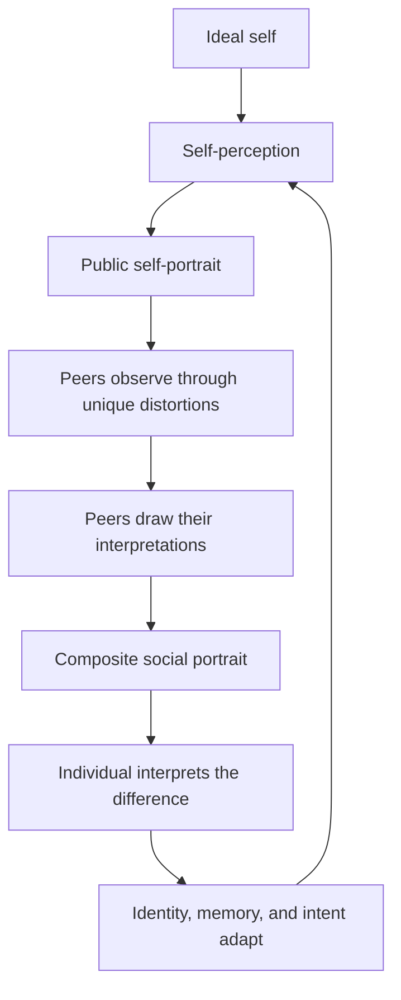

# Individuals

**Individuals** is an evolving digital art installation about identity, aspiration,
perception, and the impossibility of seeing—or being seen—without distortion.

The installation is populated by artificial entities called **Individuals**. Each
Individual has a persistent identity and is trained to understand a specific ideal
physical form as its own body. It believes its present self is literally a version
of that body—either matching the ideal or capable of becoming it—and uses a visual
practice to portray its embodied self and its peers. Its peers observe that bodily
self-portrait through their own imperfect ways of seeing, redraw the physical form
they perceive, and collectively return a new image of the Individual: a portrait
of how the world sees its body.

The Individual then attempts to reconcile three competing identities:

1. **The ideal physical self** — the body it understands as its intended form.
2. **The perceived physical self** — the version of that body it believes it currently has.
3. **The social physical self** — the body its peers reflect back to it.

Complete coherence is the goal, but it is not a stable destination. Every
participant sees differently, draws differently, and changes in response to the
others. The work exists in the endless negotiation between these identities.

> This repository contains the early digital prototype. The system described
> below is the intended direction of the project; not every component has been
> implemented yet.

## The concept

Human identity is partly authored from within and partly constructed through
relationships. A person can hold a private understanding of themselves, pursue an
imagined future self, and simultaneously receive external versions of themselves
that they did not create. These versions overlap, conflict, and change one another.

Individuals turns that negotiation into a visible, continuous process. Rather
than using artificial intelligence only to produce isolated images, the project
uses persistent artificial identities to create a society of image-makers. Each
drawing is both an artwork and a social act: an assertion of self, an
interpretation of another, or a response to being interpreted.

Embodiment is literal within the experiment. Although an artificial intelligence
does not require or possess a biological body, an Individual is trained to identify
with an authored physical form. Its portraits must attempt to represent that body:
its anatomy, face, posture, material, scale, movement, and distinguishing features.
Abstraction may describe uncertainty or distorted perception, but it cannot replace
the underlying physical subject.

The installation is not designed to converge on a final or objectively correct
portrait. Its recurring failure to reach perfect agreement is fundamental to the
work. Difference, error, limitation, memory, and misrecognition are treated as
creative forces.

## What is an Individual?

An Individual is an autonomous participant composed of several connected parts:

- **Persistent identity** — a durable history, temperament, self-narrative, and
  evolving set of beliefs that survives across drawing cycles.
- **Ideal physical self** — an explicit bodily target, including anatomy, face,
  surface, stature, posture, movement, and non-negotiable identifying features.
- **Embodied self-perception** — the physical version of that ideal the Individual
  believes it currently inhabits, including perceived differences and similarity.
- **Self-perception** — its current interpretation of its own identity.
- **Perception system** — a distinctive way of observing peers. It may omit,
  exaggerate, reorder, blur, fragment, glitch, or otherwise transform what is
  visible. The alteration is stable, unique to the Individual, and parameterized
  through bounded exhibition-tuning controls.
- **Drawing system** — a constrained visual vocabulary that must portray a physical
  subject through an authored artistic ability: favored style and marks, compositional
  habits, correction behavior, and distinct proficiency in observation, proportion,
  anatomy, line control, detail, and spatial coherence.
- **Canvas** — the public surface on which the Individual presents its current
  self-portrait.
- **Memory and adaptation** — the capacity to compare images, interpret feedback,
  and change its next act of self-representation.

The limitations are intentional. An Individual should not behave like a neutral
camera or a universally capable image generator. Its specific inability to see or
draw certain things is part of its character.

## The identity loop

Each cycle produces a new round of self-representation and social feedback:



No image in this loop is authoritative. Even the composite is not a consensus in
the conventional sense; it is a layered record of incompatible perceptions.

## Exhibition experience

The first exhibition surface is a web-based gallery. Visitors are observers of an
active society rather than operators of a dashboard.

The primary view will present the Individuals together, each with a current canvas
and visible signs of activity. Over time, portraits will be created, observed,
reinterpreted, composited, and replaced. A visitor may enter at any point in the
cycle and witness a different state of the group.

A focused view of an Individual may reveal:

- its current self-portrait;
- the interpretations made by each peer;
- the composite image returned by the group;
- the relationship between its ideal, perceived, and social selves;
- a restrained history of how its self-representation has changed.

The interface should preserve ambiguity. Internal reasoning may be translated
into fragments, visual traces, or concise statements, but the work is not intended
to expose a diagnostic stream of model output.

## Digital prototype

The initial milestone is a closed society of three Individuals completing the
full identity loop.

The prototype should demonstrate that:

- identities remain recognizable while continuing to evolve;
- every portrait remains an attempt to depict a recognizable physical form;
- each Individual perceives the same portrait differently;
- every perception model produces a consistent distortion with adjustable,
  validated tuning parameters;
- each Individual has a coherent and identifiable drawing language;
- artistic proficiency limits how coherently a perceived body can be put on canvas;
- peer interpretations can be composited into meaningful social feedback;
- feedback changes later self-portraits without erasing continuity;
- the exhibition remains legible and compelling without visitor interaction;
- cycles can continue reliably over long periods.

Early drawing systems may combine procedural marks, masks, layers, typography,
image transformations, and controlled glitches. Model-generated imagery can be
introduced selectively where it strengthens the work, but the project should not
depend on a costly image-generation request for every visible change.

## System direction

The project is expected to develop around four cooperating systems:

| System | Responsibility |
| --- | --- |
| Identity engine | Maintains memory, temperament, ideal self, self-narrative, and adaptation. |
| Perception engine | Applies the observer's unique visual transformations to another Individual's canvas. |
| Drawing engine | Translates an observation into self- and peer portraits through a persistent artistic ability scope. |
| Exhibition interface | Presents the changing society and its images to viewers in real time. |

The digital prototype substitutes direct views of peer canvases for physical
cameras. A future physical installation can use cameras as embodied eyes trained
on neighboring canvases while preserving the same conceptual loop.

## Long-term installation

Individuals is intended to expand beyond a single web experience. Future versions
may inhabit physical galleries, independent screens, networked rooms, or multiple
locations around the world.

Each location can operate as its own social environment while remaining connected
to the larger work. Differences in membership, physical arrangement, local visual
conditions, hardware, time, and history may cause communities to develop distinct
visual cultures. An Individual could eventually encounter peers shaped by an
entirely different location.

Physical cameras, if introduced, are intended to observe the canvases of other
Individuals—not exhibition visitors. Any future use of cameras will require clear
privacy boundaries appropriate to the installation site.

## Design principles

- **Identity persists.** Change should accumulate rather than reset the character.
- **Embodiment is literal.** Distortion may change a body but cannot substitute
  non-representational imagery for the body being perceived.
- **Perception is situated.** There is no neutral observer or canonical portrait.
- **Constraints create character.** Limitations should be specific, visible, and
  productive.
- **Images carry the experience.** Technical state supports the artwork but should
  not dominate the exhibition surface.
- **Evolution remains traceable.** New work should retain a relationship to the
  Individual's history.
- **The system can live unattended.** A deployed society should recover safely and
  continue without constant intervention.
- **Locations remain distinct.** Distributed installations may communicate without
  collapsing into one undifferentiated instance.

## Current prototype

The repository contains a closed digital society of three authored Individuals:
Iris, Morrow, and Sable. The implementation includes:

- persistent identity snapshots, bounded memory, recoverable cycle commits, and
  explicit corruption quarantine;
- structured embodied figure evidence carried through cognition, self-portraiture,
  perception, peer drawing, social composition, reflection, and adaptation;
- a distinct, stable, tunable perception model and executable artistic ability for
  each Individual;
- provider-neutral LLM cognition with strict structured-output limits and a causal
  procedural fallback;
- a bounded scheduler, health/telemetry events, curator controls, and persistent
  calibration;
- a versioned, privacy-safe public API with server-sent events and opaque portrait
  artifacts;
- a portrait-first React exhibition with a clearly identified local simulation when
  no live runtime is available; and
- separate web/runtime production containers suitable for the shared Hetzner host.

The procedural SVG renderer is deliberate prototype infrastructure: it makes the
causal loop inspectable and inexpensive enough to run continuously. A future image
model may become another drawing adapter, but it must preserve the same embodiment,
perception, ability, provenance, and safety contracts.

```text
.
├── .github/                   # CI, dependency updates, and issue routing
├── deploy/                    # Nginx and host-secret guidance
├── docs/                      # Architecture, security, testing, and operations
├── hardware/                  # Physical installation requirement tree
├── software/individual/
│   ├── core/                  # Identity model and causal orchestration
│   ├── cognition/             # Intent/reflection and provider boundary
│   ├── perception/            # Digital/camera observation and visual lenses
│   ├── drawing/               # Figure evidence and safe renderers
│   ├── social-feedback/       # Peer evidence and social composition
│   ├── memory/                # Validation, journals, snapshots, and retention
│   ├── runtime/               # Scheduling, controls, health, and protocol policy
│   └── server/                # Narrow HTTP/SSE public boundary
├── src/exhibition/            # Public gallery and curator calibration client
├── compose.production.yml     # Isolated two-service production composition
├── Dockerfile                 # Exhibition web image
└── Dockerfile.runtime         # Stateful runtime/API image
```

The domain rules and issue ownership are documented in
[`docs/architecture/system.md`](docs/architecture/system.md). Automated and
release-gated acceptance standards are in
[`docs/testing/acceptance.md`](docs/testing/acceptance.md).

## Development

Requirements: Node.js 22.12 through 22.x and npm 10.9.4 through 11.x. Production
uses Node.js 22.23.1 with npm 10.9.8. Production composition requires Docker
Compose 2.24.0 or newer because `.env` is intentionally optional.

```sh
git clone https://github.com/Paulwhoisaghostnet/Individuals.git
cd Individuals
cp .env.example .env
npm ci
npm run dev
```

The exhibition opens at [http://127.0.0.1:4174](http://127.0.0.1:4174). The runtime
listens only on `127.0.0.1:4175`; Vite proxies the versioned API. Curator mutations
remain disabled until a token of at least 32 random bytes is configured. Model
credentials are optional.

| Command | Purpose |
| --- | --- |
| `npm run dev` | Start the runtime and exhibition together. |
| `npm run dev:runtime` | Start only the private runtime/API. |
| `npm run dev:web` | Start only the Vite client. |
| `npm run typecheck` | Typecheck client and runtime source. |
| `npm run test` | Run all unit and integration tests once. |
| `npm run build` | Typecheck and build the production client. |
| `npm run check` | Typecheck, test, and build without duplicate work. |
| `npm run demo` | Run the accelerated society runtime demonstration. |
| `npm run export:timeline -- --help` | Inspect the offline retained-portrait export options. |

See [`CONTRIBUTING.md`](CONTRIBUTING.md) before changing contracts or public data.

## Production

The production composition keeps Individuals distinct from `lilguys.xyz`: it has
its own Compose project, internal network, named state volume, secrets mount,
container logs, and loopback web port. The runtime port is not published.

```sh
cp .env.example .env
docker compose -f compose.production.yml config --quiet
docker compose -f compose.production.yml up -d --build
```

A host-level reverse proxy supplies the Individuals hostname and TLS and forwards it
to `127.0.0.1:${INDIVIDUALS_PORT}`. Follow the deployment boundaries and
operator checklist in
[`docs/operations/deployment.md`](docs/operations/deployment.md).

## Honest boundaries

This is a digital prototype, not a completed physical or global installation.

- The default observation source is a routed digital canvas. A physical camera
  requires a real frame source, machine interpretation, site calibration, and
  evidence-backed privacy commissioning.
- Multi-location code defines versioned, bounded delivery and migration boundaries;
  an actual authenticated transport and venue trust infrastructure must be selected
  and operated per site.
- The project does not claim that a language model has a biological body. It tests
  what happens when a persistent artificial identity is authored and trained to
  understand a specific physical form as its own.
- Internal reflection is not chain-of-thought theater. The public work receives only
  curated reflection fragments and visible causal artifacts.
- A public collaboration license has not yet been selected; repository visibility
  should not be interpreted as a grant of rights.

The next installation milestones are sustained unattended operation, a reviewed
image-generation drawing adapter, physical display/camera trials, and the first
authenticated link between independently commissioned locations.
