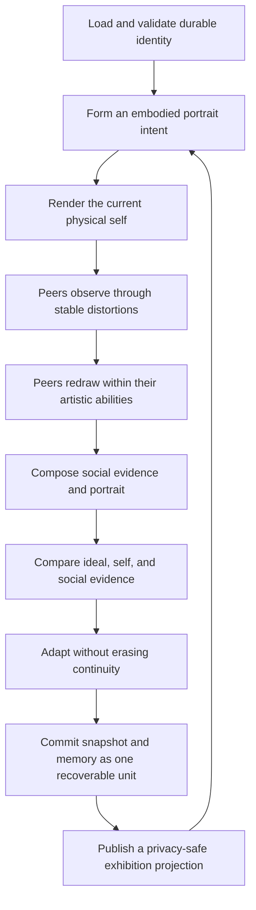

# System architecture

Individuals is organized as a set of cooperating domains around one causal identity
loop. The boundaries are intentional: the exhibition must never become the runtime,
the language model must never become the identity, and a transport failure must not
corrupt durable state.

## Domain map

| Domain | Owns | Must not own |
| --- | --- | --- |
| `core` | Identity state, cycle contracts, orchestration, invariants | HTTP, files, model-provider details, UI |
| `cognition` | Intent and reflection adapters, prompts, validated structured output | Durable identity, drawing, transport |
| `perception` | Stable observer-specific transformations and observation evidence | Peer intent, social composition, UI controls |
| `drawing` | Embodied figure descriptions, artistic constraints, safe portrait rendering | Perception policy, persistence, HTTP |
| `social-feedback` | Peer-drawing evidence and social portrait composition | Reflection decisions, scheduling |
| `memory` | Validated snapshots, bounded memories, recovery and quarantine | Cycle policy, public projection |
| `runtime` | Scheduling, concurrency, budgets, pause/resume, health | Browser rendering, raw HTTP parsing |
| `server` | Public projections, HTTP/SSE transport, authorization and request validation | Private narrative, prompt construction, identity mutation rules |
| `exhibition` | Portrait-first visitor experience and ephemeral curator controls | Filesystem reads, secret persistence, synthetic live claims |
| `communications` | Versioned envelopes and multi-location transport boundaries | Shared mutable state between locations |

Dependencies point toward contracts rather than concrete infrastructure. In
particular, `core` receives systems through interfaces; storage, providers, clocks,
renderers, and transports remain replaceable adapters.

## Causal cycle

Every arrow carries typed evidence. Reflection does not infer the artwork from a
filename or caption: it receives the embodied figure description, observed changes,
peer interpretations, and composite measurements produced earlier in the cycle.

## Non-negotiable invariants

- A portrait depicts an authored physical form. Abstraction may alter or obscure
  that form, but may not replace it with an unrelated abstract pattern.
- Each observer applies its own bounded, repeatable perception profile before its
  drawing system acts. Perception and drawing limitations are separate causes.
- The current self concept and portrait intent affect visible geometry, posture,
  features, materials, and mark-making—not only captions.
- Social feedback is traceable to peer observations and drawings.
- Adaptation preserves recognizable identity and does not mechanically converge to
  a perfect score. Irreducible disagreement is part of the work.
- Provider failure degrades to a bounded procedural path and is observable without
  exposing prompts, credentials, or private narrative.
- The public API is a projection, never a serialized internal snapshot.
- Production state lives in a mounted data volume and is never committed to Git.

## Runtime and presentation boundary

The production deployment contains two processes:

1. A private runtime/API service owns engines, persistence, schedules, provider
   calls, controls, and the event stream.
2. A public web service serves immutable client assets and reverse-proxies the
   narrow `/api/` surface to the runtime.

The browser consumes an initial versioned snapshot and then an SSE stream. It may
poll as a recovery mechanism, but it never reads server files or silently advances a
fake live cycle. An explicitly labeled local simulation remains useful for gallery
design and offline demonstration.

## Multi-location boundary

Locations remain autonomous. The implemented protocol core provides versioned,
bounded, sequence-aware envelopes, acknowledgements, durable retry, and idempotent
application contracts. Every delivery and application attempt has a bridge-owned
deadline in addition to a cooperative cancellation signal; a non-settling adapter
therefore cannot hold the sequencing/state boundary forever. Validated envelopes
and retained bridge state are detached immutable copies rather than shared caller
objects. No production transport or venue trust system is selected.

Before inter-site exchange is commissioned, its adapter must authenticate and
encrypt peers, authorize sites, rotate keys, and carry only the public artifact
payload defined by the protocol. Locations must not share a writable database,
copy provider credentials, or treat network delivery as proof of application.
Local identity continues through an outage and reconciles through replay-safe
envelopes when connectivity returns.

An application deadline does not prove that a non-cooperative handler produced no
late side effect. The destination withholds acknowledgement and sequence advancement
on timeout, and the required message-ID idempotency makes a later retry safe.

Identity claims remain source-owned across every portrait role. A self or social
portrait may attach a signal for its source-owned subject; a peer portrait may
attach a signal only for its source-owned artist, never for the destination-owned
subject it depicts. The destination treats the image as a remote observation, not
as authority to rewrite the subject's identity.
