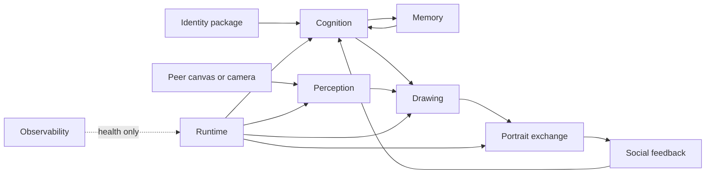

# Individual software stack

The Individual software stack contains everything required for one artificial
identity to form an intention, draw itself, observe peers, draw its perceptions,
receive a social portrait, reflect, adapt, remember, and continue across restarts.

## Capability flow

The implemented orchestration and shared domain language live in `core/`. Other
branches define the production adapters that will satisfy those contracts. The
core must not import a model vendor SDK, camera driver, database client, or web UI.

## What every Individual receives

| Capability | Required contents |
| --- | --- |
| Identity | Manifest, ideal self, persistent traits, authored constraints, assets |
| Cognition | Intention and reflection implementation with bounded model context |
| Perception | One or more explicit visual transformation pipelines |
| Drawing | Self and peer portrait renderers with stable visual constraints |
| Memory | Durable snapshot storage and recall policy |
| Social feedback | Validated routing and composite construction |
| Device I/O | Canvas output plus digital-view or physical-camera input |
| Communications | Typed exchange of portraits, presence, and cycle events |
| Runtime | Startup, scheduling, recovery, configuration, and shutdown |
| Observability | Health metrics that do not leak private identity content |
| Security | Secret injection, least privilege, artifact verification, update policy |
| Simulation | Repeatable peers and device substitutes for offline validation |

The first digital prototype may run several Individuals on shared hardware, but
each must retain an independent identity package, state namespace, memory namespace,
cycle lifecycle, and failure boundary.
